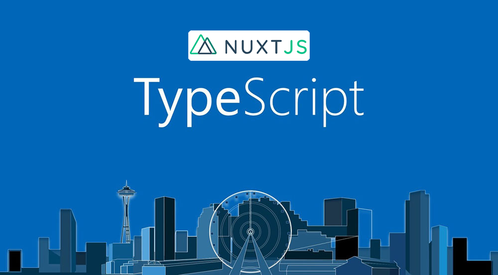

# :bento: typescript-nuxtjs-boilerplate



example url: [https://typescript-nuxtjs-boilerplate.netlify.com/example](https://typescript-nuxtjs-boilerplate.netlify.com/example)

---

## ⛑ Requirements

* Node.js v10+

## 💾 Install

First, clone the repo via git:

```bash
$ git clone --recursive git@github.com:typescript-nuxtjs-boilerplate/typescript-nuxtjs-boilerplate.git
```

### Install yarn

**for mac**  

```bash
$ brew install yarn
```

**for windows**  

[Use installer](https://yarnpkg.com/lang/en/docs/install/#windows-tab)

### Install dependencies

Using yarn:

```bash
yarn install
```

Using npm:

```bash
npm install
```

## Run sample server at localhost:5000

```bash
$ node ./tools/server.js
```

## 🔌 Serve with hot reload at localhost:4000

```bash
$ yarn run dev
```

or

```bash
$ yarn run local
```

and run mock server for examples

```bash
$ node ./tools/server.js
```

## Build for production on docker and launch server

```bash
$ yarn run build:docker
$ yarn start
```

## Build for production and `SPA mode`

```bash
$ yarn run build:static
```

It will be published in the `dist` directory

For detailed explanation on how things work, checkout [Nuxt.js docs](https://nuxtjs.org).

## :blue_book: Example Links

[サンプル集 - typescript-nuxtjs-boilerplate-docs](https://typescript-nuxtjs-boilerplate-docs.netlify.com/#/nuxt/examples)

## 🖥 npm-scripts

[npm scriptsの解説 - typescript-nuxtjs-boilerplate-docs](https://typescript-nuxtjs-boilerplate-docs.netlify.com/#/nuxt/npm-scripts)

## 📚 Docs

See our [docs and guides here](https://typescript-nuxtjs-boilerplate-docs.netlify.com/#/)

## ⚙️ Maintainers

- [hisasann](https://github.com/hisasann)

## 🍜 License

MIT © [hisasann](https://github.com/hisasann)

<a href="https://twitter.com/hisasann"></a>

